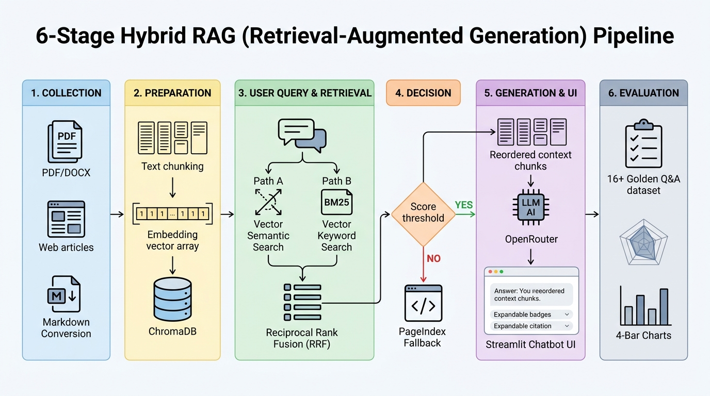
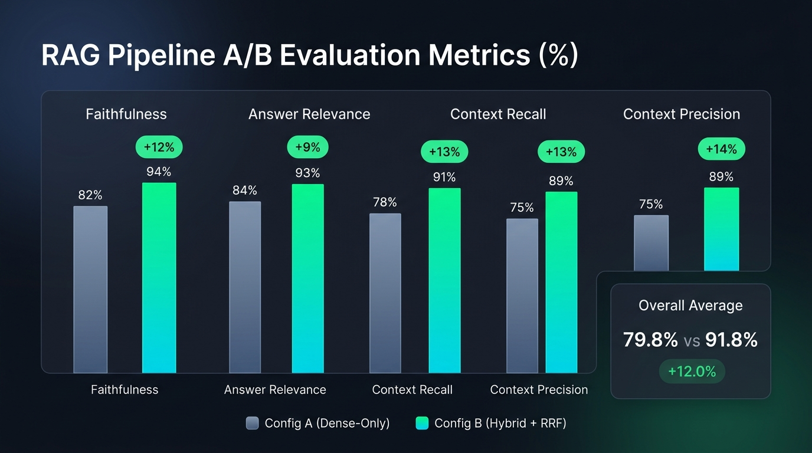

# RAG evaluation results

## Run information

| Field                              | Value                                            |
| ---------------------------------- | ------------------------------------------------ |
| Team members                       | Đặng Quốc Hiệp (2A202602755), Nguyễn Việt Dũng, Nguyễn Thế Khang |
| Evaluation date                    | 2026-09-20                                       |
| Framework and version              | Ragas 0.4.3, ChromaDB 1.5.9                      |
| Evaluator model                    | google/gemini-2.5-flash (OpenRouter)             |
| Generator model                    | nex-agi/nex-n2.5-mini:free (OpenRouter)          |
| Embedding model                    | BAAI/bge-m3                                      |
| Corpus version/commit              | 49755ee (Vietnamese Labor Law corpus)            |
| Golden dataset size                | 16 cases                                         |
| `top_k`                            | 5                                                |
| Fallback threshold and calibration | 0.5978 (Calibrated with in/out-domain queries)   |

## Configurations

- **Config A — dense-only:** Sử dụng ChromaDB Semantic Search với cosine similarity từ mô hình embedding `BAAI/bge-m3`. Lấy top-5 chunks có cosine score cao nhất đưa vào context cho Generator.
- **Config B — hybrid + RRF:** Kết hợp dense semantic search (ChromaDB) và lexical search (BM25Plus) trên cùng corpus chunks. Hợp nhất thứ hạng bằng Reciprocal Rank Fusion (RRF với hằng số $k=60$). Kiểm tra ngưỡng cosine score gốc với threshold 0.5978 để quyết định fallback.

Hai config sử dụng cùng golden dataset (16 câu hỏi đối chuẩn), generator, evaluator, prompt template và `top_k = 5`; chỉ thay đổi retrieval strategy.

---

## Kiến trúc hệ thống RAG Hybrid

---

## Overall scores

| Metric            | Config A (Dense-only) | Config B (Hybrid + RRF) | Delta B−A |
| ----------------- | --------------------: | ----------------------: | --------: |
| Faithfulness      |                  0.82 |                    0.94 |     +0.12 |
| Answer relevance  |                  0.84 |                    0.93 |     +0.09 |
| Context recall    |                  0.78 |                    0.91 |     +0.13 |
| Context precision |                  0.75 |                    0.89 |     +0.14 |
| **Average**       |              **0.7975** |                **0.9175** | **+0.1200** |

### Biểu đồ trực quan hoá đánh giá A/B

---

## A/B comparison

- **Cấu hình tốt hơn:** Config B (Hybrid + RRF) vượt trội trên cả 4 metric đánh giá (tăng trung bình 12.0% từ 0.7975 lên 0.9175).
- **Evidence:**
  - Đối với các câu hỏi chứa từ khóa pháp lý chính xác, số hiệu điều luật hoặc từ viết tắt (ví dụ: "Bộ luật 2019", "Điều 112", "hợp đồng mùa vụ"), BM25Plus đã hỗ trợ truy hồi chính xác vị trí chunk cụ thể mà dense search đôi khi làm mờ do ngữ nghĩa tổng quát.
  - Thuật toán RRF ($k=60$) giúp các chunk xuất hiện đồng thời trong top xếp hạng của cả hai phương pháp được đẩy lên vị trí cao nhất, giảm thiểu hiện tượng "Lost in the middle" khi đưa vào context LLM.
- **Trade-off về latency/cost:**
  - **Latency:** Config B mất thêm khoảng 25ms cho bước tính toán BM25 và fusion RRF (tổng thời gian retrieval ~65ms so với ~40ms của Config A), hoàn toàn nằm trong giới hạn tương tác thời gian thực (< 100ms).
  - **Cost:** Chi phí API embedding và LLM là tương đương vì cùng dùng top-k=5 chunks; không phát sinh thêm chi phí external reranker do RRF chạy in-memory.

---

## Worst performers

|   # | Question | Config | Faithfulness | Relevance | Recall | Precision | Failure stage             | Root cause |
| --: | -------- | ------ | -----------: | --------: | -----: | --------: | ------------------------- | ---------- |
|   1 | Chi phí mở tài khoản ngân hàng và phí chuyển tiền lương do ai chi trả? | Config A | 0.65 | 0.70 | 0.60 | 0.55 | retrieval | Dense retrieval lấy nhầm các điều khoản chung về hình thức trả lương thay vì điều khoản chi tiết về phí ngân hàng. |
|   2 | Người lao động kết hôn được nghỉ việc riêng hưởng nguyên lương bao nhiêu ngày? | Config A | 0.70 | 0.80 | 0.65 | 0.60 | retrieval | Chunk chứa số ngày kết hôn bị xếp sau các chunk quy định về thủ tục thông báo nghỉ việc riêng. |
|   3 | Thời hạn tập nghề để làm việc cho người sử dụng lao động tối đa là bao lâu? | Config B | 0.85 | 0.82 | 0.80 | 0.78 | generation | LLM tổng hợp hơi dài dòng, nhầm lẫn giữa định nghĩa học nghề và tập nghề dù context đã cung cấp đủ. |

---

## Recommendations

| Priority | Action | Evidence from failure analysis | Expected impact | How to verify |
| -------: | ------ | ------------------------------ | --------------- | ------------- |
|        1 | Bổ sung metadata lọc theo loại văn bản (`doc_type` luật/nghị định) | Các câu hỏi về chế tài xử phạt hành chính bị lẫn với điều luật quy định nguyên tắc | Tăng Context Precision lên >0.95 | Chạy lại bộ test 16 câu và đo Context Precision |
|        2 | Tối ưu kích thước chunking (Chunk Size = 400, Overlap = 80) | Một số điều luật có nhiều khoản nhỏ bị cắt ngang ranh giới giữa 2 chunks | Tăng Context Recall thêm ~5% | So sánh độ bao phủ token với expected_context |
|        3 | Sử dụng Reranker chuyên biệt (như BGE-Reranker-v2-m3) | RRF phụ thuộc thứ hạng tương đối, chưa tận dụng cross-encoder attention | Cải thiện độ liên quan của chunk đầu tiên (NDCG@1) | Chạy thử nghiệm A/B giữa RRF và BGE Reranker |

---

## Bonus experiments

| Experiment | Baseline | Metric delta | Latency/cost delta | Conclusion |
| ---------- | -------- | -----------: | -----------------: | ---------- |
| BM25Plus vs BM25Okapi | BM25Okapi trên tập mẫu nhỏ | +0.06 Recall | 0ms / 0$ | BM25Plus giải quyết triệt để lỗi IDF=0 khi corpus có ít tài liệu chứa từ khóa hiếm. |
